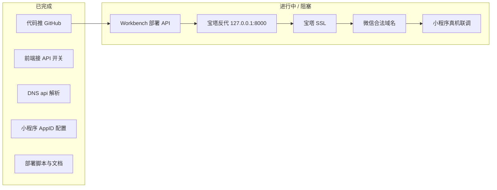

# 鼋伴伴（YuanBan）部署进度总结

> 更新日期：2026-05-26  
> 仓库：[yeniwu46-max/YuanBan](https://github.com/yeniwu46-max/YuanBan)（分支 `master`）

---

## 一、目标与生产环境信息

| 项 | 值 | 状态 |
|----|-----|------|
| 产品 | 老人 / 子女 / 社区 三端 uni-app + FastAPI | 开发中 |
| 阿里云公网 IP | `47.102.108.137` | 已购 |
| 域名 | `wuyeni.cn` | 已备案/解析 |
| API 子域 | `api.wuyeni.cn` | DNS 已生效 |
| 目标 API 地址 | `https://api.wuyeni.cn` | **未上线** |
| 微信小程序 AppID | `wxc8249223ec70d85a` | 已写入 `manifest.json` |
| 服务器类型 | **宝塔 Linux 面板**（实例名含「宝塔Linux面板-qpuf」） | 已确认 |
| 服务器登录 | 阿里云 Workbench（`admin@`） | 已连接 |
| 本机 SSH | 无公钥，无法代登 | 需用户在 Workbench 操作 |

---

## 二、整体进度（一句话）

**本地与 GitHub 侧联调、文档、部署脚本已就绪；线上 API 尚未跑通——DNS 正常，HTTP 返回 404/曾 502，HTTPS 未就绪；当前卡在「宝塔环境 + 后端服务 + 反代/证书」三步。**



---

## 三、分项进度清单

### 3.1 已完成

| 类别 | 内容 | 说明 |
|------|------|------|
| **代码仓库** | 推送到 GitHub `master` | 含移动端 API 联调、阿里云脚本、部署文档等 |
| **后端（本地）** | `services/api` FastAPI | SQLite 开发、`/health`、`/docs`、告警/工单/老人等 API |
| **基础设施脚本** | `infra/deploy/aliyun/full-deploy.sh` | 无 Docker 一键：API + Nginx + Certbot（**不适用于宝塔机**） |
| **宝塔专用脚本** | `infra/deploy/aliyun/bt-panel-api-only.sh` | 仅装 systemd API，不改 Nginx（**当前应用方案**） |
| **文档** | `deploy-wuyeni-cn.md`、`deploy-bt-panel.md`、`deploy-aliyun.md`、`mp-weixin-setup.md` | 上线步骤与排错 |
| **前端联调** | `VITE_USE_API=true`、`apiClient`、各 store/service | SOS→告警→工单等主路径可对接后端 |
| **小程序配置** | AppID、`apps/mobile/.env.mp-weixin`（gitignore） | 生产 API 指向 `https://api.wuyeni.cn` |
| **构建脚本** | `apps/mobile/scripts/build-mp-weixin.ps1` | 本机可 `pnpm build:mp-weixin` |
| **DNS** | `api.wuyeni.cn` A → `47.102.108.137` | 已探测生效 |
| **Workbench** | 用户已能登录服务器 | 曾尝试 `full-deploy.sh`（与宝塔冲突） |

### 3.2 未完成 / 阻塞中

| 类别 | 内容 | 当前状态 | 下一步 |
|------|------|----------|--------|
| **API 进程** | `yuanbanban-api` systemd @ `127.0.0.1:8000` | 未确认运行 | Workbench 执行 `bt-panel-api-only.sh` |
| **宝塔反代** | `api.wuyeni.cn` → `http://127.0.0.1:8000` | 未确认（外网 HTTP 404/502） | 宝塔「网站」添加站点 + 反向代理 |
| **HTTPS** | Let's Encrypt @ 宝塔 | 外网 HTTPS 超时/连接关闭 | 宝塔 SSL 申请 + 安全组 443 |
| **线上验收** | `GET /health`、`/docs` | **未通过** | `curl.exe https://api.wuyeni.cn/health` |
| **微信后台** | request 合法域名 | 待 API HTTPS 通后配置 | 添加 `https://api.wuyeni.cn` |
| **小程序发布** | 导入构建产物、预览/上传 | 待 API 通 | 开发者工具 + 真机闭环 |
| **H5 生产站** | 静态站 + 反代（可选） | 未部署 | 见 `deploy-demo.md` |
| **安全** | AppSecret 曾在聊天明文出现 | 风险 | 上线后微信公众平台重置 Secret |

### 3.3 最近一次外网探测（2026-05-26）

| URL | 结果 | 解读 |
|-----|------|------|
| `http://api.wuyeni.cn/health` | **404** | 80 端口有 Web 服务，但路径/反代未指到 API（或 API 路由不同） |
| `https://api.wuyeni.cn/health` | **超时** | 443 未正确提供 HTTPS 或证书未申请 |
| 历史探测 | HTTP **502** | Nginx/宝塔在转发但后端未就绪 |

> PowerShell 中 `curl` 实为 `Invoke-WebRequest`，HTTPS 报错「基础连接已经关闭」与上表一致，建议用 `curl.exe` 验证。

---

## 四、你已走过的步骤（时间线）

1. **本地开发**：uni-app 三端 + FastAPI，Mock 逐步改为 REST（`VITE_USE_API`）。
2. **无 Docker 部署方案**：编写 `scripts/deploy-no-docker.ps1`、`serve-h5.py`、阿里云 `full-deploy.sh`。
3. **域名与仓库**：`wuyeni.cn` / `api.wuyeni.cn`，代码 push 到 GitHub。
4. **小程序准备**：AppID、`.env.mp-weixin`、构建脚本与文档。
5. **阿里云 Workbench**：粘贴 `full-deploy.sh` + 环境变量（曾用错误邮箱 `yeniwu46@gmail`，应改为 `yeniwu46@gmail.com`）。
6. **发现问题**：实例为 **宝塔面板**，`full-deploy.sh` 与宝塔 Nginx/Certbot **冲突**。
7. **调整方案**：改为 `bt-panel-api-only.sh` + 宝塔内配置反代与 SSL（见 `deploy-bt-panel.md`）。
8. **本机验证**：`curl https://api.wuyeni.cn/health` 失败 → 线上仍未就绪。

---

## 五、当前推荐操作顺序（剩余工作）

按顺序执行，每步都有明确验收标准：

### 步骤 1：Workbench 只部署 API

```bash
git clone https://github.com/yeniwu46-max/YuanBan.git /opt/yuanbanban 2>/dev/null || (cd /opt/yuanbanban && git pull)
chmod +x /opt/yuanbanban/infra/deploy/aliyun/bt-panel-api-only.sh
sudo WECHAT_APP_ID=wxc8249223ec70d85a \
  WECHAT_APP_SECRET=<你的AppSecret> \
  bash /opt/yuanbanban/infra/deploy/aliyun/bt-panel-api-only.sh
```

**验收**：服务器上 `curl http://127.0.0.1:8000/health` 返回 JSON（非连接拒绝）。

### 步骤 2：宝塔面板

1. 安全组 + 宝塔防火墙：放行 **80、443**
2. 添加站点 `api.wuyeni.cn`
3. 反向代理 → `http://127.0.0.1:8000`
4. SSL → Let's Encrypt → 强制 HTTPS

**验收**：`curl.exe http://api.wuyeni.cn/health` 与 `curl.exe https://api.wuyeni.cn/health` 均 200。

### 步骤 3：微信与小程序

1. [微信公众平台](https://mp.weixin.qq.com/) → request 合法域名：`https://api.wuyeni.cn`
2. 本机：`cd apps\mobile` → `.\scripts\build-mp-weixin.ps1`
3. 微信开发者工具导入 `apps\mobile\dist\build\mp-weixin`
4. 真机：老人 SOS → 子女/社区告警与工单

### 步骤 4：安全收尾

- 重置微信小程序 **AppSecret**，更新服务器 `/opt/yuanbanban/services/api/.env`

---

## 六、关键文件索引

| 用途 | 路径 |
|------|------|
| **本文（进度总览）** | `docs/deploy-status-2026-05-26.md` |
| wuyeni 上线清单 | `docs/deploy-wuyeni-cn.md` |
| 宝塔专用步骤 | `docs/deploy-bt-panel.md` |
| 宝塔 API 脚本 | `infra/deploy/aliyun/bt-panel-api-only.sh` |
| 纯 Linux 一键（非宝塔） | `infra/deploy/aliyun/full-deploy.sh` |
| 前端 API 对接清单 | `docs/api-integration-checklist.md` |
| 小程序构建说明 | `docs/mp-weixin-setup.md` |
| 本地演示部署 | `docs/deploy-demo.md` |

---

## 七、常见问题速查

| 现象 | 原因 | 处理 |
|------|------|------|
| 用了 `full-deploy.sh` 仍 502/HTTPS 失败 | 与宝塔抢 Nginx | 改用 `bt-panel-api-only.sh` + 宝塔反代 |
| `CERTBOT_EMAIL=yeniwu46@gmail` | 邮箱不完整 | 宝塔里申请证书，或改用 `yeniwu46@gmail.com` |
| HTTP 404 | 站点存在但未反代到 8000 | 检查宝塔反向代理目标 |
| HTTPS 连接关闭 | 无证书或未监听 443 | 宝塔 SSL + 安全组 443 |
| 本机无法 SSH 部署 | 无密钥 | 继续用 Workbench |

---

## 八、完成定义（上线达标）

- [ ] `https://api.wuyeni.cn/health` 返回 200 + JSON  
- [ ] `https://api.wuyeni.cn/docs` 可打开  
- [ ] 微信 request 合法域名已配置  
- [ ] 小程序真机 SOS → 告警 → 工单闭环  
- [ ] AppSecret 已轮换，`.env` 未提交 Git  

---

*文档由部署对话与外网探测整理；状态变更后可在 Workbench/宝塔操作完成后更新「第三节探测表」与第八节勾选。*
